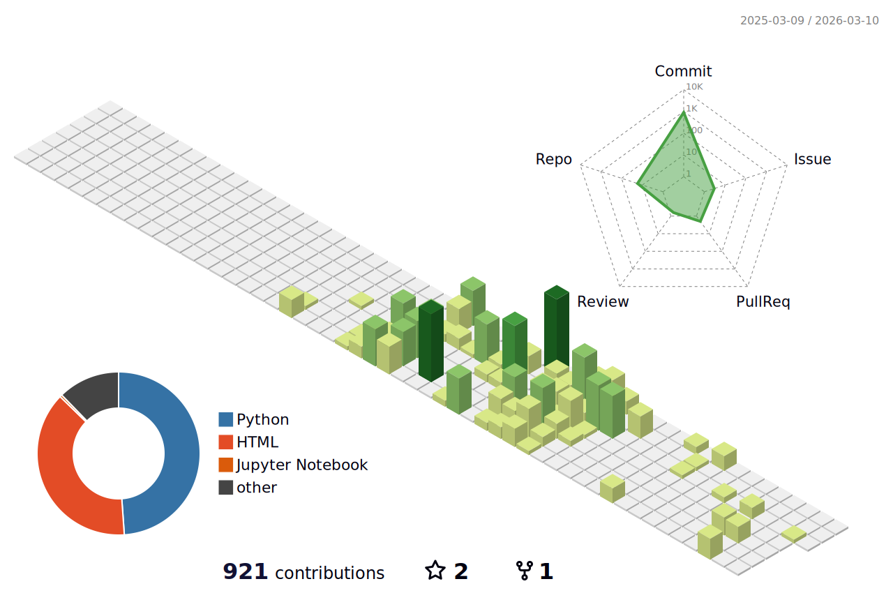

<p align="center">
  
</p>

<p align="center">
  
</p>

<h3 align="center">
  🧠 Data Systems Engineer | AI Infrastructure | Cloud-Native Pipelines
</h3>

---

### 🧬 System Boot
> ```
> Initializing Quantum Core...
> Loading AnkitShukla-arch...
> Status: ONLINE ✅
> Uplink: DataOps | AI | Automation
> ```

---


### 🧠 System Activity — Current Operations
<p align="center">
  
</p>


---

### ⚙️ Tech Arsenal
<p align="center">
  <!-- Core stack -->
  <br><br>

  <!-- Data & ML Libraries -->
  
  
  
  
  
</p>


---

### 💼 Featured Projects
<table align="center">
<tr>
<td align="center">
<a href="https://github.com/AnkitShukla-arch/DATA-FILTER-AND-STORAGE-MODEL">

</a>
</td>
<td align="center">
<a href="https://github.com/AnkitShukla-arch/Offline-Movie-Recommender">

</a>
</td>
</tr>
<tr>
<td align="center">
<a href="https://github.com/AnkitShukla-arch/data_pipeline_project">

</a>
</td>
<td align="center">
<a href="https://github.com/AnkitShukla-arch/Basic-Password-Manager">

</a>
</td>
</tr>
</table>


---

### 🏅 Certifications

<p align="center">
  <a href="https://www.credly.com/badges/your-data-science-orientation" target="_blank">
    
  </a>
  <a href="https://www.credly.com/badges/your-python-ai" target="_blank">
    
  </a>
  <a href="https://www.credly.com/badges/your-data-science-methodology" target="_blank">
    
  </a>
  <a href="https://www.credly.com/badges/your-tools-for-data-science" target="_blank">
    
  </a>
  <a href="https://www.credly.com/badges/your-python-project" target="_blank">
    
  </a>
  <a href="https://www.credly.com/badges/your-sql-data-science" target="_blank">
    
  </a>
  <a href="https://www.credly.com/badges/your-data-analysis-python" target="_blank">
    
  </a>
</p>

<p align="center">
  <i>Click any certificate to verify on Credly • IBM & Coursera Certified ⚡</i>
</p>


---

### 🐍 System Processes
<p align="center">
  
</p>


---

### 📡 Connect With Me
<p align="center">
  <a href="mailto:monishukla727538@gmail.com"></a>
  <a href="https://linkedin.com/in/ankit-shukla"></a>
  <a href="https://github.com/AnkitShukla-arch"></a>
</p>

---

---

### 📊 GitHub Contribution Metrics

<p align="center">
  
</p>

---

### 🧱 3D Contribution Graph

<p align="center">
  
</p>

---

<p align="center">
  
</p>

---

```bash
> System Status: ONLINE
> Version: 2025.10
> Quantum Engine: ACTIVE ⚡
