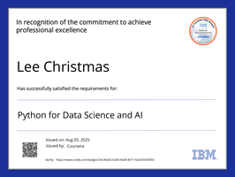
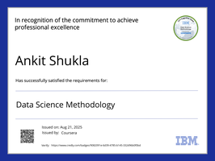

<p align="center">
  
</p>

<h3 align="center">
  🧠 Data Systems Engineer | AI Infrastructure | Cloud-Native Pipelines
</h3>

---

### 🧬 System Boot
> ```
> Initializing Quantum Core...
> Loading AnkitShukla-arch...
> Status: ONLINE ✅
> Uplink: DataOps | AI | Automation
> ```

---


### 🧠 System Activity — Current Operations
<p align="center">
  
</p>


---

### ⚙️ Tech Arsenal
<div align="center">

<!-- CSS for animation -->
<style>
.tech-icon {
  transition: transform 0.3s ease, filter 0.3s ease;
}
.tech-icon:hover {
  transform: scale(1.2);
  filter: drop-shadow(0 0 10px #00BFFF);
}
</style>

<!-- Core Stack -->
<br><br>

<!-- ML & Data Libraries -->


</div>


---

### 💼 Featured Projects
<table align="center">
<tr>
<td align="center">
<a href="https://github.com/AnkitShukla-arch/DATA-FILTER-AND-STORAGE-MODEL">

</a>
</td>
<td align="center">
<a href="https://github.com/AnkitShukla-arch/Offline-Movie-Recommender">

</a>
</td>
</tr>
<tr>
<td align="center">
<a href="https://github.com/AnkitShukla-arch/data_pipeline_project">

</a>
</td>
<td align="center">
<a href="https://github.com/AnkitShukla-arch/Basic-Password-Manager">

</a>
</td>
</tr>
</table>


---

### 🏅 Certifications
<p align="center">
  
  
  
  
  
  
  
</p>

---

### 📊 Telemetry
<p align="center">
  
  
</p>

<p align="center">
  
</p>

---

### 🐍 System Processes
<p align="center">
  
</p>

---

### 📡 Connect With Me
<p align="center">
  <a href="mailto:monishukla727538@gmail.com"></a>
  <a href="https://linkedin.com/in/ankit-shukla"></a>
  <a href="https://github.com/AnkitShukla-arch"></a>
</p>

---

<p align="center">
  
</p>

---

```bash
> System Status: ONLINE
> Version: 2025.10
> Quantum Engine: ACTIVE ⚡
