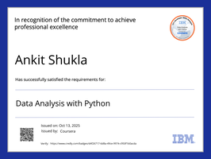

<p align="center">
  
</p>

<h3 align="center">
  🧠 Data Systems Engineer | AI Infrastructure | Cloud-Native Pipelines
</h3>

---

### 🧬 System Boot
> ```
> Initializing Quantum Core...
> Loading AnkitShukla-arch...
> Status: ONLINE ✅
> Uplink: DataOps | AI | Automation
> ```

---

### 🚀 Currently Working On
- 🔒 **LeakHawk** — OSINT-based Cyber Threat Detection  
- 🎬 **Movie Recommender** — Hybrid ML Engine  
- 🧠 **Voice Assistant** — Emotion-aware AI System  
- ☁️ **Data Pipeline Automation** — ETL + DataOps on AWS  

---

### ⚙️ Tech Arsenal
<p align="center">
  
</p>

---

### 💼 Featured Projects
<table align="center">
<tr>
<td align="center">
<a href="https://github.com/AnkitShukla-arch/LeakHawk">

</a>
</td>
<td align="center">
<a href="https://github.com/AnkitShukla-arch/movie-recommender">

</a>
</td>
</tr>
<tr>
<td align="center">
<a href="https://github.com/AnkitShukla-arch/voice-assistant">

</a>
</td>
<td align="center">
<a href="https://github.com/AnkitShukla-arch/data-pipeline">

</a>
</td>
</tr>
</table>

---

### 🏅 Certifications
<p align="center">
  
  
  
  
  
  
  
</p>

---

### 📊 Telemetry
<p align="center">
  
  
</p>

<p align="center">
  
</p>

---

### 🐍 System Processes
<p align="center">
  
</p>

---

### 📡 Connect With Me
<p align="center">
  <a href="mailto:monishukla727538@gmail.com"></a>
  <a href="https://linkedin.com/in/ankit-shukla"></a>
  <a href="https://github.com/AnkitShukla-arch"></a>
</p>

---

<p align="center">
  
</p>

---

```bash
> System Status: ONLINE
> Version: 2025.10
> Quantum Engine: ACTIVE ⚡
