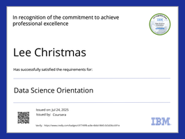

<p align="center">
  
</p>

<p align="center">
  
</p>

<h3 align="center" style="font-size:22px;">
  🧠 Data Systems Engineer | AI Infrastructure | Cloud-Native Pipelines
</h3>

<br>


<a href="https://www.python.org/"></a>

<h2>🧠 Daily AI Insight</h2>

<!--QUOTE-START-->
<p align="center"></p>
<!--QUOTE-END-->

---

<h2>🧬 System Boot</h2>

> ```
> Initializing Quantum Core...
> Loading AnkitShukla-arch...
> Status: ONLINE ✅
> Uplink: DataOps | AI | Automation
> ```

---

<h2>🧠 System Activity — Current Operations</h2>

<p align="center">
  
</p>

---

<h2>⚙️ Tech Arsenal</h2>

<p align="center">
  <br><br>

  
  
  
  
  
</p>

---

<h2>💼 Featured Projects</h2>

<table align="center">
<tr>
<td align="center">
<a href="https://github.com/AnkitShukla-arch/DATA-FILTER-AND-STORAGE-MODEL">

</a>
</td>
<td align="center">
<a href="https://github.com/AnkitShukla-arch/Offline-Movie-Recommender">

</a>
</td>
</tr>
<tr>
<td align="center">
<a href="https://github.com/AnkitShukla-arch/data_pipeline_project">

</a>
</td>
<td align="center">
<a href="https://github.com/AnkitShukla-arch/Basic-Password-Manager">

</a>
</td>
</tr>
</table>

---

<h2>🏅 Certifications & Badges</h2>

<table align="center">
  <tr>
    <td align="center"><br><sub><b>Data Science Orientation</b></sub></td>
    <td align="center"><br><sub><b>Python for Data Science</b></sub></td>
    <td align="center"><br><sub><b>Data Science Methodology</b></sub></td>
  </tr>
  <tr>
    <td align="center"><br><sub><b>Databases & SQL</b></sub></td>
    <td align="center"><br><sub><b>Applied Data Science</b></sub></td>
    <td align="center"><br><sub><b>Tools for Data Science</b></sub></td>
  </tr>
</table>

---

<h2>🐍 System Processes</h2>
<p align="center">
  
</p>

---

<h2>🧱 3D Contribution Graph</h2>

<p align="center">
  
</p>

---

<p align="center">
  
</p>

---

```bash
> System Status: ONLINE
> Version: 2025.10
> Quantum Engine: ACTIVE ⚡


