<p align="center">
  
</p>
<p align="center">
  
</p>

<br>


<a href="https://www.python.org/"></a>

<h2>🧠 Daily AI Insight</h2>

<!--QUOTE-START-->
<p align="center"></p>
<!--QUOTE-END-->


<h2>🧬 System Boot</h2>

> ```
> Initializing Quantum Core...
> Loading AnkitShukla-arch...
> Status: ONLINE ✅
> Uplink: DataOps | AI | Automation
> ```


<h2>🧠 System Activity — Current Operations</h2>

<p align="center">
  
</p>

---

<h2 align="center">📊 GitHub Performance</h2>

<p align="center">
  
</p>

<p align="center">
  
</p>


<h2>🛠️ Tech Arsenal</h2>

<h3>Languages & Frameworks</h3>
<p align="center">
  
</p>

<h3>Data Science & ML</h3>
<p align="center">
  
  
  
  
  
</p>

<h3>Tools & Platforms</h3>
<p align="center">
  
</p>

<h3>Cloud & DevOps</h3>
<p align="center">
  
  
  
  
</p>
</div>

<h2>💼 Featured Projects</h2>

<table align="center">
<tr>
<td align="center">
<a href="https://github.com/AnkitShukla-arch/DATA-FILTER-AND-STORAGE-MODEL">

</a>
</td>
<td align="center">
<a href="https://github.com/AnkitShukla-arch/Offline-Movie-Recommender">

</a>
</td>
</tr>
<tr>
<td align="center">
<a href="https://github.com/AnkitShukla-arch/data_pipeline_project">

</a>
</td>
<td align="center">
<a href="https://github.com/AnkitShukla-arch/Basic-Password-Manager">

</a>
</td>
</tr>
</table>

---

## 🥇 Certifications & Badges

<table align="center">

<!-- Row 1 -->
<tr>
  <td align="center">
    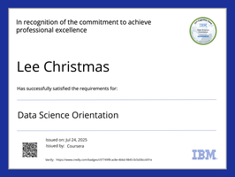<br/>
    <sub><b>Data Science Orientation</b></sub>
  </td>
  <td align="center">
    <br/>
    <sub><b>Python for Data Science</b></sub>
  </td>
  <td align="center">
    <br/>
    <sub><b>Data Science Methodology</b></sub>
  </td>
  <td align="center">
    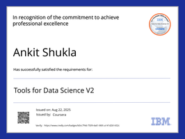<br/>
    <sub><b>Tools for Data Science</b></sub>
  </td>
</tr>

<!-- Row 2 -->
<tr>
  <td align="center">
    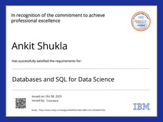<br/>
    <sub><b>Databases & SQL</b></sub>
  </td>
  <td align="center">
    <br/>
    <sub><b>Applied Data Science</b></sub>
  </td>
  <td align="center">
    <br/>
    <sub><b>Data Analysis with Python</b></sub>
  </td>
  <td align="center">
    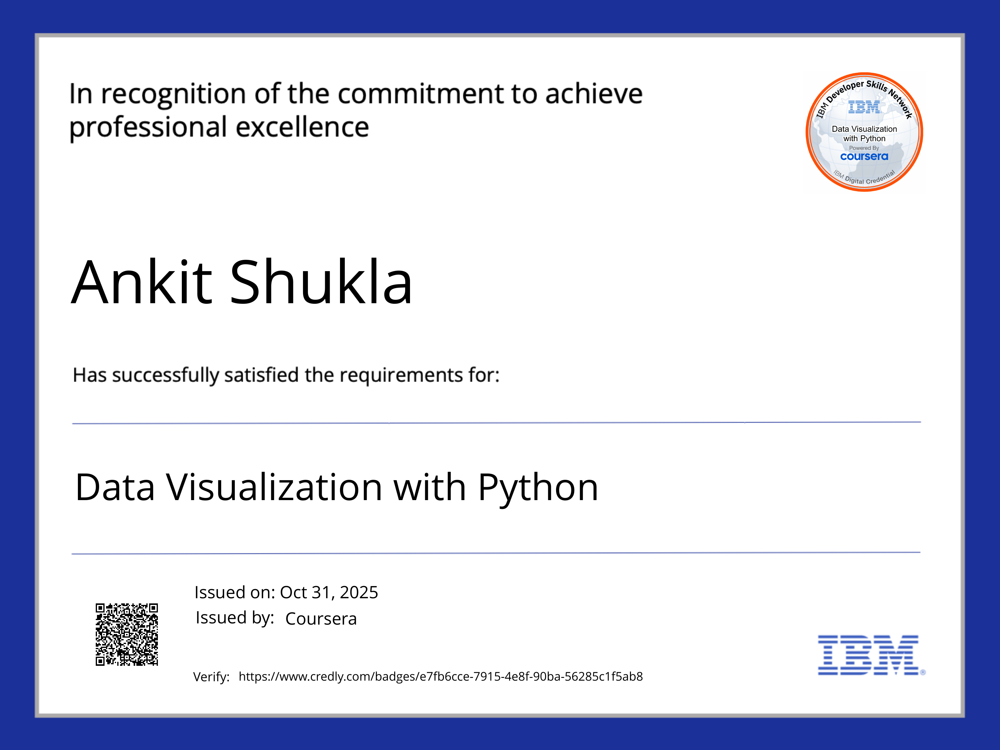<br/>
    <sub><b>Data Visualization with Python</b></sub>
  </td>
</tr>

<!-- Row 3 (last one centered) -->
<tr>
  <td align="center">
    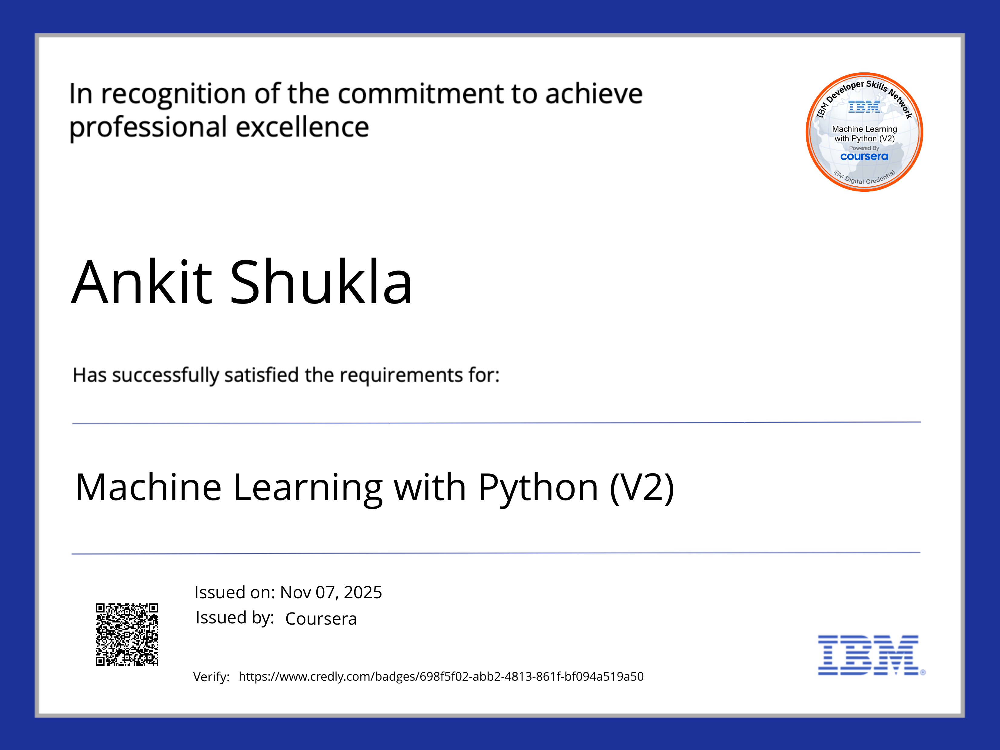<br/>
    <sub><b>Machine Learning with Python</b></sub>
  </td>

  <td align="center">
    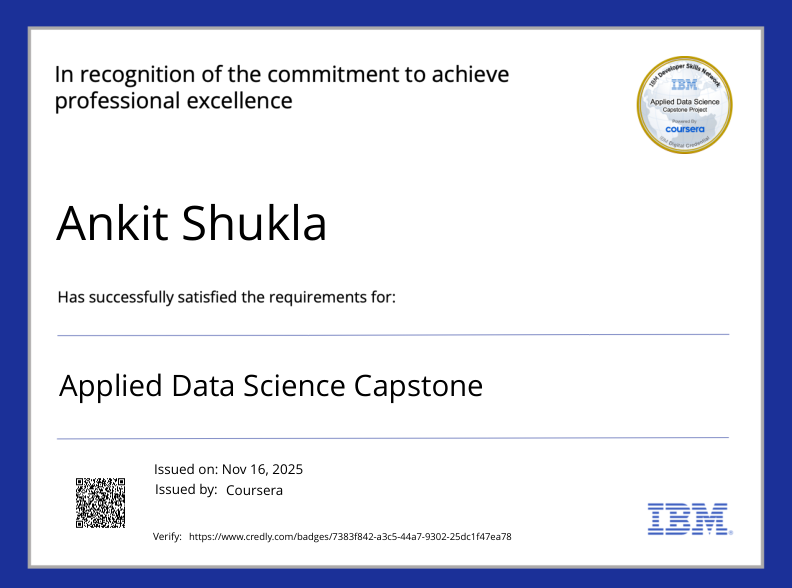<br/>
    <sub><b>Data Science Capstone</b></sub>
  </td>

  <td align="center">
    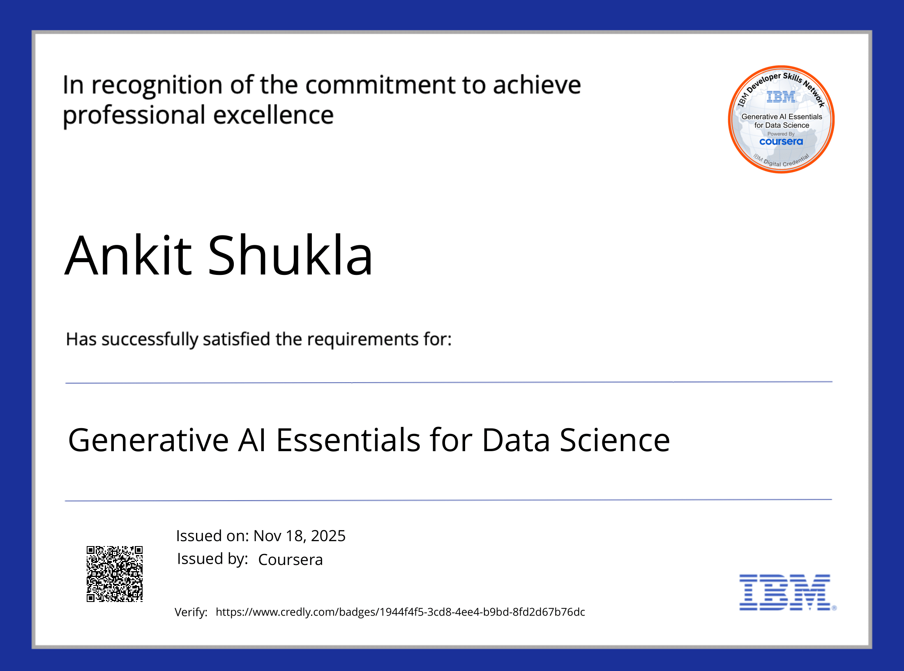<br/>
    <sub><b>Generative A.I.</b></sub>
  </td>

 <td align="center">
    <br/>
    <sub><b>IBM Data Science</b></sub>
  </td>
</tr>

<!-- Row 4 -->
<tr>
  <td align="center">
    <br/>
    <sub><b>Introduction to Git and Github</b></sub>
  </td>
  <td align="center">
    <br/>
    <sub><b>Data Engineering Foundation on AWS</b></sub>
  </td>
  <td align="center">
    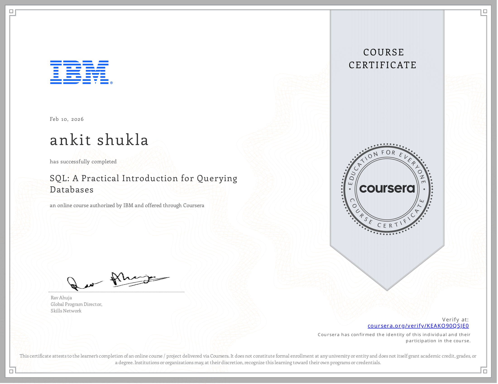<br/>
    <sub><b>SQL:An Introduction for Querying Database</b></sub>
  </td>
  <td align="center">
    <br/>
    <sub><b>Introduction to Data Engineerinf</b></sub>
  </td>
</tr>

  <!-- Row 5 -->
<tr>
  <td align="center">
    <br/>
    <sub><b>Data Warehouse Fundamentals</b></sub>
  </td>
</tr>
</table>


<h2>🏆 Hackathons</h2>

<div align="center">
  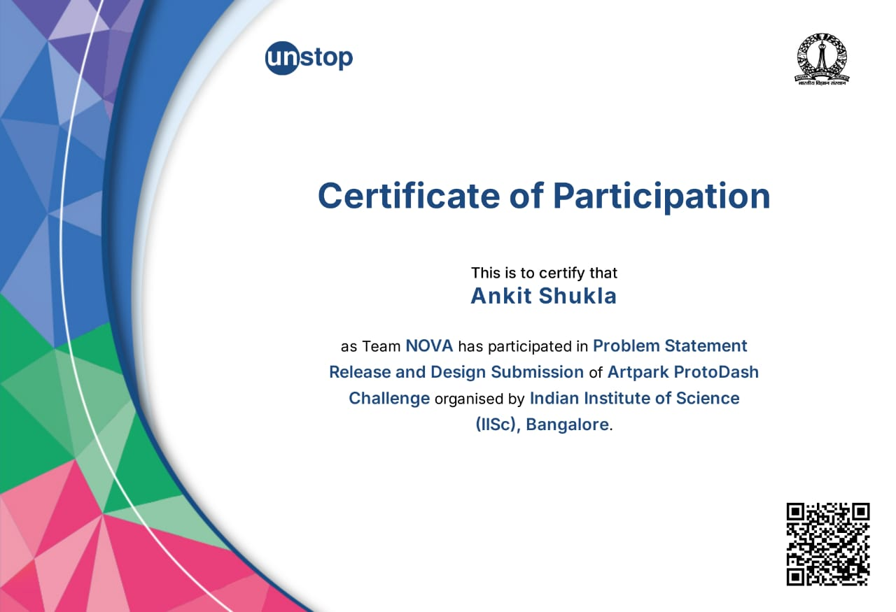
  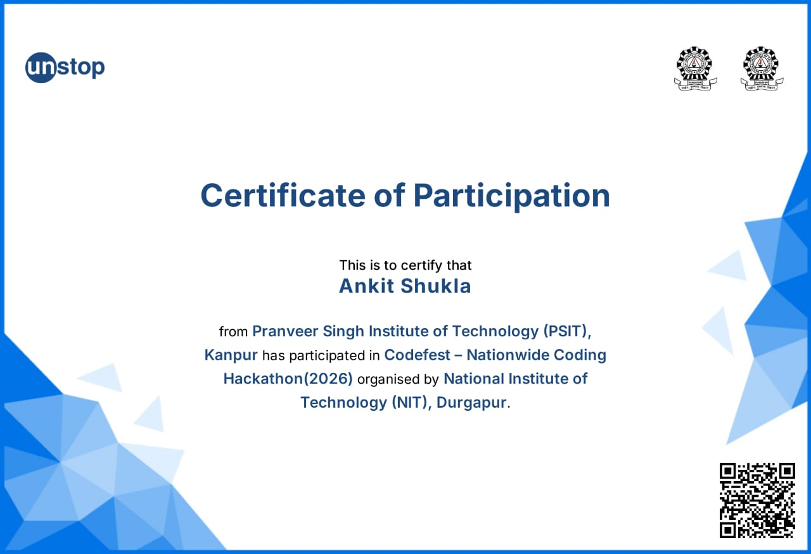
  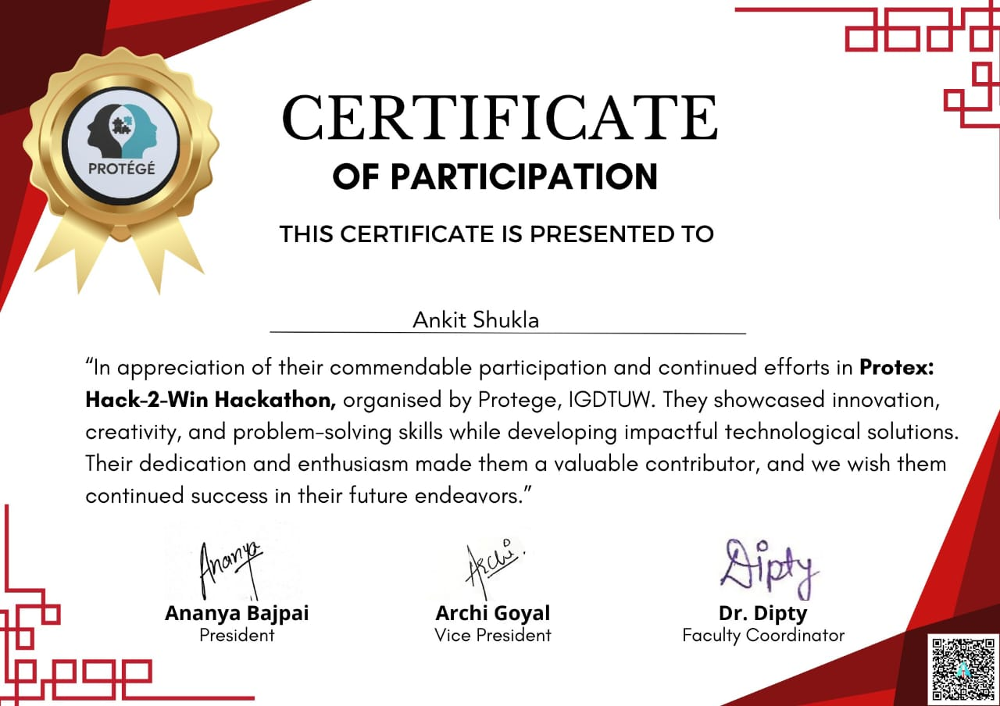
  
</div>
---

<h2>🐍 System Processes</h2>
<p align="center">
  
</p>

---

<h2>🧱 3D Contribution Graph</h2>

<p align="center">
  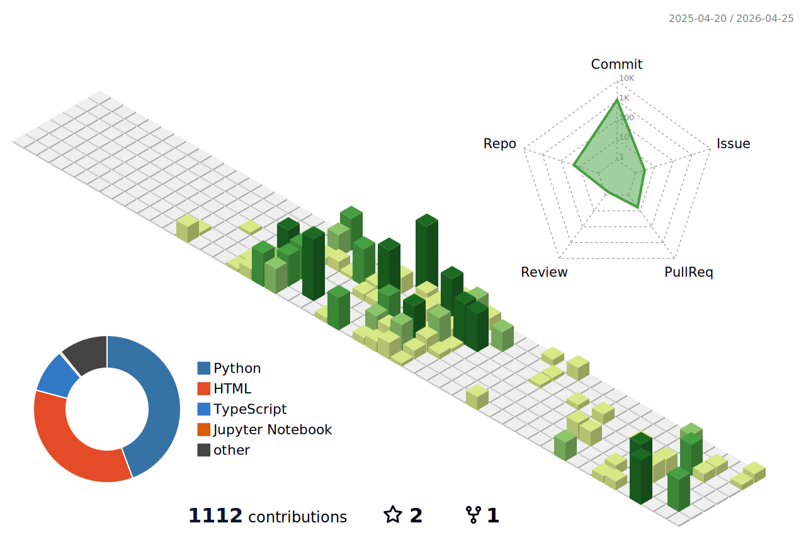
</p>

---

<p align="center">
  
</p>

---

```bash
> System Status: ONLINE
> Version: 2026.10
> Quantum Engine: ACTIVE ⚡
```
<br/>


<br/>


